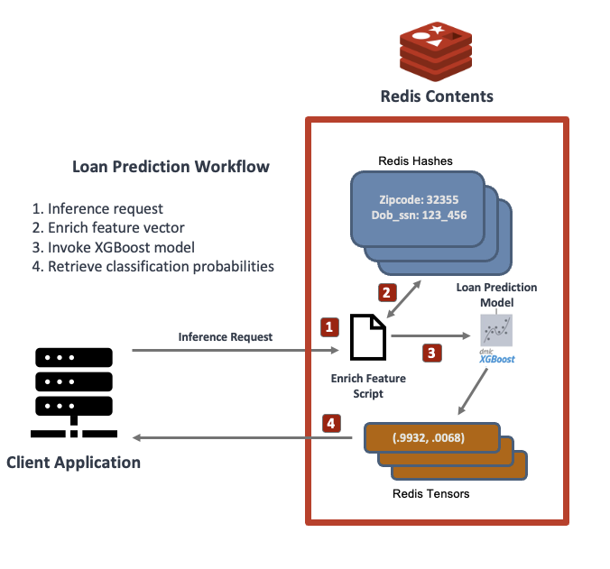
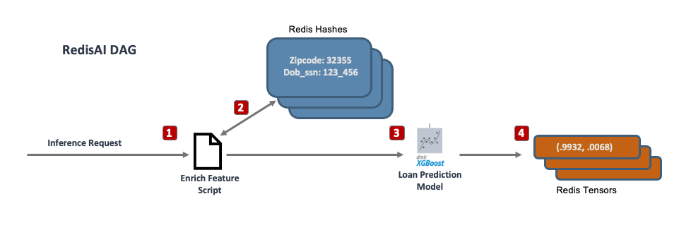

<div align="center">
    <a href="https://github.com/RedisVentures/loan-prediction-microservice"></a>
    <br />
    <br />
<div display="inline-block">
    <a href="https://github.com/RedisAI/RedisAI"><b>RedisAI</b></a>&nbsp;&nbsp;&nbsp;
    <a href="https://github.com/RedisVentures/loan-prediction-microservice"><b>Code</b></a>&nbsp;&nbsp;&nbsp;
  </div>
    <br />
    <br />
</div>


## Loan Prediction Microservice

This repo shows how to build a simple microservice for predicting loan approval.
The service uses Redis as a feature store for both consumer credit and geographically
based census data.

The purpose of this service is to demonstrate how to build low-latency machine learning
applications with Redis and RedisAI. The diagram of the service is shown below:

<br />
<div align="center">


</div>

### Feature and Inference Serving

The service utilizes Redis as both a Feature Store and an inference Server through
the utilization of RedisAI. This means that both machine learning features, and
the XGBoost model in this demo are co-located in the same Redis instance.

With RedisAI, a single inference call can
1. Process input arguments
2. Collect and process features
3. Execute the XGBoost model with the features as the input
4. Return the result

To do this, a RedisAI ``DAG`` (directed acyclic graph) is used to chain together
``Torch`` code, ONNX-converted XGBoost models, and redis commands.

Here is an example of the operations that are performed in the DAG.

<br />
<div align="center">

</div>

### Running the Service

To run the service, bring up the docker containers as follows

```bash
$ docker compose up
```

Once it's running, a Jupyter Lab server will start that contains two
notebooks for

1. Training the XGBoost model
2. Deploying the inference system into RedisAI

Click (or copy-paste) the link to the jupyter lab in the docker logs to open
it in a browser.
